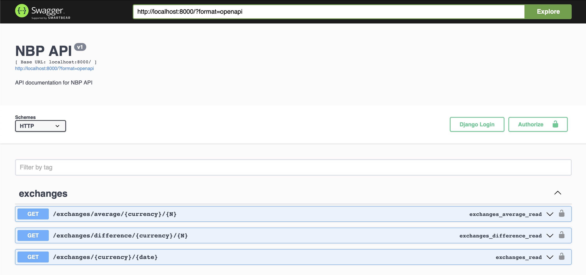

# dynatrace-backend

@@ author -> Maciej Szefler - ma.szefler@gmail.com

This app was made for the backend internship task at Dynatrace. It uses Docker, Swagger UI and unit tests.

## Packages

On Windows:

```bash
$ cd Downloads/internship_task # most probably
$ python -m venv venv
$ venv\Scripts\activate
$ pip install -r requirements.txt 

```

On macOS/Linux:

```bash
$ cd Downloads/internship_task # most probably
$ python -m venv venv
$ source venv/bin/activate
$ pip install -r requirements.txt 
```

## Docker

```bash
$ cd nbp_api_querer
$ docker-compose up
```

To rebuild project, use:

```bash
$ cd nbp_api_querer
$ docker-compose build
```


## Unit Tests

```bash
$ cd nbp_api_querer
$ python manage.py test querer
```

## Usage

To start a server using Docker, just type:

```bash
$ cd nbp_api_querer
$ docker-compose up
```

Instead type:

```bash
$ cd nbp_api_querer
$ python manage.py runserver
```

If you want to use the app by Swagger UI, go to the url:

```localhost:8000```



## Operations

After starting the server, you can use Swagger UI to query operations, but you can also do them manually.

### 1. Given a date (formatted YYYY-MM-DD) and a currency code, provide its average exchange rate.

```
http://localhost:8000/exchanges/{currency}/{date}
```

Query:

```bash
curl http://localhost:8000/exchanges/GBP/2023-01-02
```

Response:

```json
5.2768
```

### 2. Given a currency code and the number of last quotations N (N <= 255), provide the max and min average value (every day has a different average).

```
http://localhost:8000/exchanges/average/{currency}/{N}
```

Query:

```bash
curl http://localhost:8000/exchanges/average/GBP/10
```

Response:

```json
{
  "min": 5.2086,
  "max": 5.3369
}
```

### 3. Given a currency code and the number of last quotations N (N <= 255), provide the major difference between the buy and ask rate (every day has different rates). 

```
http://localhost:8000/exchanges/difference/{currency}/{N}
```

Query:

```bash
http://localhost:8000/exchanges/difference/eur/20
```

Response:

```json
{
  "max_diff": 0.0938
}
```
